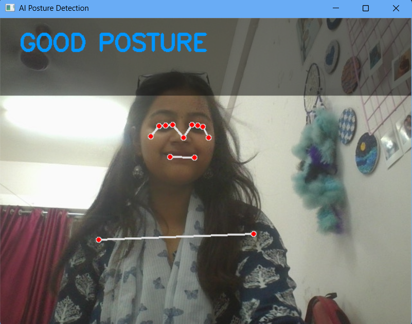
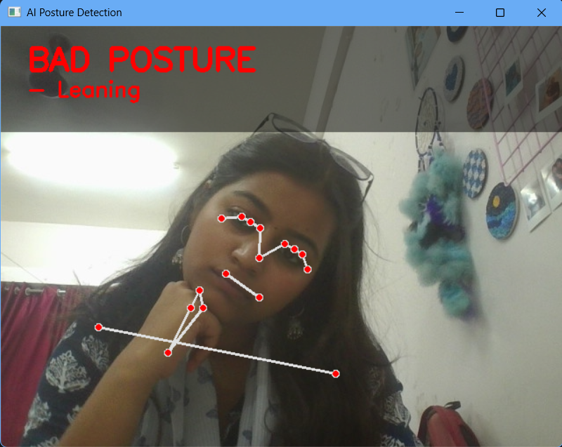
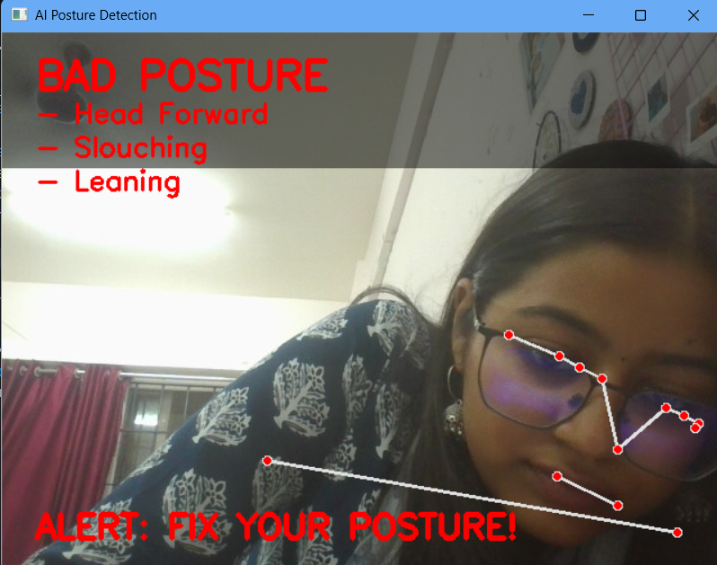

# AI-Based Real-Time Posture Detection System

## 1. Overview

This project presents a real-time computer vision system for detecting and evaluating human posture using pose estimation. The system analyzes body alignment and provides immediate feedback regarding posture quality without requiring any training dataset.

## 2. Objective

To develop an efficient and lightweight posture monitoring system that identifies incorrect ergonomic positions and provides real-time feedback using computer vision techniques.

## 3. Features

* Real-time posture detection using webcam input
* Multi-parameter posture evaluation:

  * Head forward detection
  * Slouching detection
  * Shoulder imbalance detection
* Issue-specific feedback display
* Time-based alert mechanism for prolonged poor posture
* Clean and structured user interface

## 4. Methodology

The system utilizes **MediaPipe Pose** for extracting human body landmarks from video frames. Posture is evaluated using rule-based logic applied to spatial relationships between key landmarks.

### Parameters Considered:

* Vertical alignment between head and shoulders
* Horizontal displacement of the head
* Symmetry of shoulder positions

A posture is classified as incorrect if any of the defined conditions are violated.

## 5. System Architecture

Input (Webcam) → Pose Estimation → Landmark Extraction → Rule-Based Analysis → Output Display

## 6. Technologies Used

* Python
* OpenCV
* MediaPipe
* NumPy

## 7. Installation and Execution

### Install dependencies:

pip install -r requirements.txt

### Run the application:

python src/main.py

## 8. Output

### Good Posture

### Bad Posture

### Alert Condition

## 9. Results

The system successfully detects posture in real time and identifies specific ergonomic issues. It provides clear visual feedback and alerts when poor posture is sustained.

## 10. Future Scope

* Integration with mobile or web-based platforms
* Addition of audio feedback mechanisms
* Use of machine learning models for enhanced accuracy
* Personalized posture correction suggestions

## 11. Conclusion

The project demonstrates the application of computer vision in ergonomic monitoring. It provides an effective and practical solution for real-time posture assessment using lightweight and accessible technologies.

---

Pratyaksha Singh
